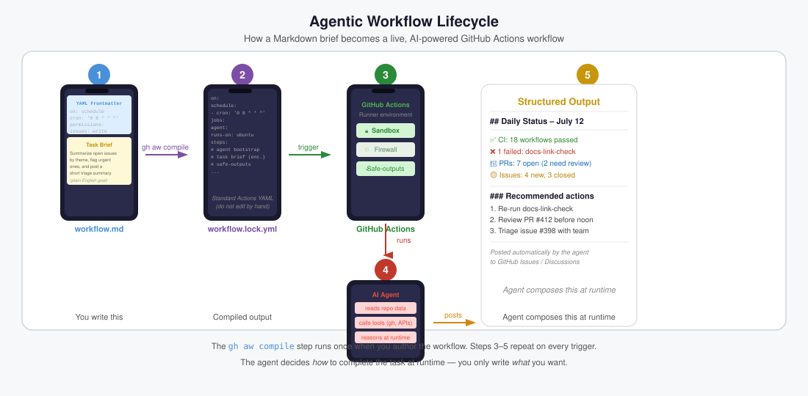

# rig

`rig` is a minimal TypeScript agent harness skill for sandboxed agentic workflows.



## Install

```bash
gh skill install githubnext/rig
```

## Use Rig in 2 ways

### 1) As a skill for Rig programs that use the Copilot SDK

Pin the skill in your workflow:

```yaml
engine:
  id: copilot
  copilot-sdk: true
skills:
  - githubnext/rig/skills/rig/SKILL.md@<full-commit-sha>
```

Then write a Rig program. Here is a full release pipeline with specialized sub-agents:

```ts
import { agent, p, s } from "rig";

// Agent role: summarize the release candidate changes.
const analyzeChanges = agent({ model: "small",
  input: s.object({ diff: s.string, commits: s.string }),
  output: s.object({ summary: s.string, highlights: s.array(s.string) }),
  instructions: "Summarize the release candidate changes.",
});
// Agent role: choose the safest semantic version bump.
const chooseVersion = agent({ model: "small",
  input: s.object({ summary: s.string, highlights: s.array(s.string) }),
  output: s.object({ bump: s.enum("patch", "minor", "major"), rationale: s.string }),
  instructions: "Choose the safest semantic version bump.",
});
// Agent role: draft the release note from the chosen version bump.
const draftRelease = agent({ model: "small",
  input: s.object({ bump: s.enum("patch", "minor", "major"), rationale: s.string, summary: s.string }),
  output: s.object({ title: s.string, checklist: s.array(s.string), risks: s.array(s.string) }),
  instructions: "Draft the release note from the chosen version bump.",
});
// Agent role: plan the next release using the provided specialists.
const releaseAgent = agent({ model: "small",
  instructions: p`Plan the next release using ${p.bash("git diff --stat -- .")} and ${p.bash("git log --oneline -20")}.`,
  output: s.object({ title: s.string, bump: s.enum("patch", "minor", "major"), checklist: s.array(s.string), risks: s.array(s.string) }),
  agents: { analyzeChanges, chooseVersion, draftRelease },
});

export default releaseAgent;
```

### 2) Run a Rig program directly with `skills/rig/rig.ts`

**Design on the fly** — just describe what you want as a string and let the model figure out the rest:

```bash
cat <<'RIG' | node skills/rig/rig.ts
export default "Run npm test, diagnose any failures, apply the smallest safe fix, and repeat up to 3 times.";
RIG
```

Or ask Copilot (with the skill) to generate a full program for you. Describe your goal in natural language and Copilot returns a runnable `rig` markdown fence like this:

````markdown
```rig
import { agent, p, s } from "rig";
// Agent role: diagnose failing tests and decide if the loop is done.
const diagnose = agent({
  model: "small",
  input: s.object({ ok: s.boolean, stdout: s.string, exitCode: s.number }),
  output: s.object({ done: s.boolean, rootCause: s.string }),
  instructions: "Diagnose test failures. Set done to true if all tests passed.",
});
// Agent role: apply the smallest safe fix for the root cause.
const fix = agent({
  model: "small",
  output: s.object({ summary: s.string, changed: s.boolean }),
  instructions: "Apply the smallest safe fix for the root cause.",
});
// Agent role: run a RALF loop iterating diagnose-fix cycles until tests pass.
const ralfLoop = agent({
  model: "large",
  output: s.object({ iterations: s.number, fixed: s.boolean }),
  agents: { diagnose, fix },
  instructions: p`Run ${p.bash("npm test")} then loop: diagnose failures, fix, repeat up to 3 times.`,
});
export default ralfLoop;
```
````

Extract the fence contents and pipe them directly to the launcher:

```bash
cat <<'RIG' | node skills/rig/rig.ts
# paste the rig fence contents here
RIG
```

Or run a program file:

```bash
echo "Review this diff" | node skills/rig/rig.ts src/program.ts
```

Use `--typecheck` to validate a program without running it:

```bash
cat program.ts | node skills/rig/rig.ts --typecheck
```

## Docs

See [skills/rig/SKILL.md](skills/rig/SKILL.md) for construction rules,
[skills/rig/references/runtime.md](skills/rig/references/runtime.md) for launcher and engine details, and
[skills/rig/references/claude-workflow-conversion.md](skills/rig/references/claude-workflow-conversion.md)
for porting Claude Code dynamic workflows to rig.
